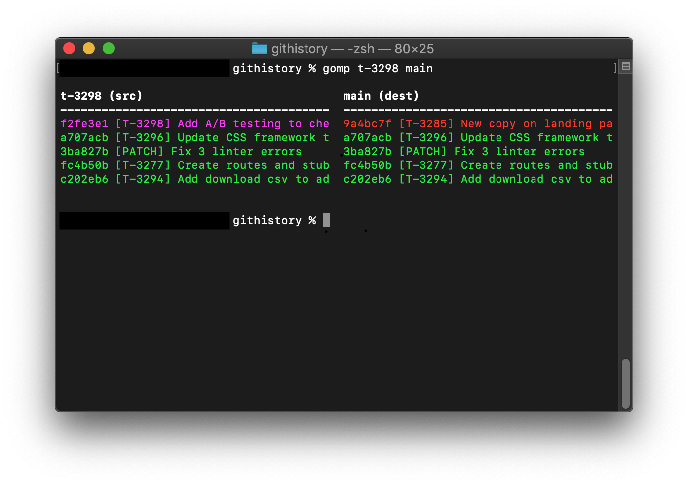

# GOMP (**G**it c**OMP**are)

GOMP is a Git-based tool for comparing branches, designed to work with a rebase-oriented Git workflow. Markforged uses GOMP as both a daily tool for handling commits and merges and as a powerful way to visualize complex histories while preparing releases.



Read about the [Markforged Git workflow](https://engineering.markforged.com/#/blog/post/git_at_markforged) on our software engineering blog.

## Installing GOMP

GOMP is based on Python 3 and has no dependencies outside of the Python standard library. It is available for installation over pip:

```bash
$ pip install gomp
```

Alternately, you can clone the repository and include the following alias in your shell profile:

```bash
$ alias gomp="python /path/to/gomp/gomp.py"
```

Gomp has been tested on MacOS only but should be compatible with most flavors of Linux.

## Using GOMP

With gomp installed, navigate to any directory that has a git repository with multiple branches. Our hypothetical repository has two branches: `feature` and `main`. Run:

```bash
$ gomp feature main
```

This command shows a visual comparison between the two branches.

Use the flag `--key` to see a key explaining the color codes.

Use the flag `--recut` to receive output that, when entered into an interactive rebase, will put commits from `feature` on top of commits from `main`.

GOMP's output is color-coded:

* Green text means that the commit matches between branches.
* Yellow text means that a commit on the both branches but the commits are in a different order.
* Red text means that a commit is on the target branch and not the source branch.
* Purple text means that a commit is on the source branch and not the target branch.

## Contributing to GOMP

Thank you for wanting to help us improve GOMP. Markforged welcomes pull requests to improve GOMP's functionality, reliability, and ease of use. All contributions are subject to our guidelines.

You can learn more about the process of preparing an internal tool for public use [on our engineering blog](https://engineering.markforged.com/#/blog/post/preparing_gomp).

The [Python 2 version of GOMP](legacy) is not under active development and is accepting bug fixes only.

GOMP has no dependencies outside of the Python standard library, we'd like to keep it that way.

## License

GOMP is released by [Markforged under the MIT License](LICENSE.md).
